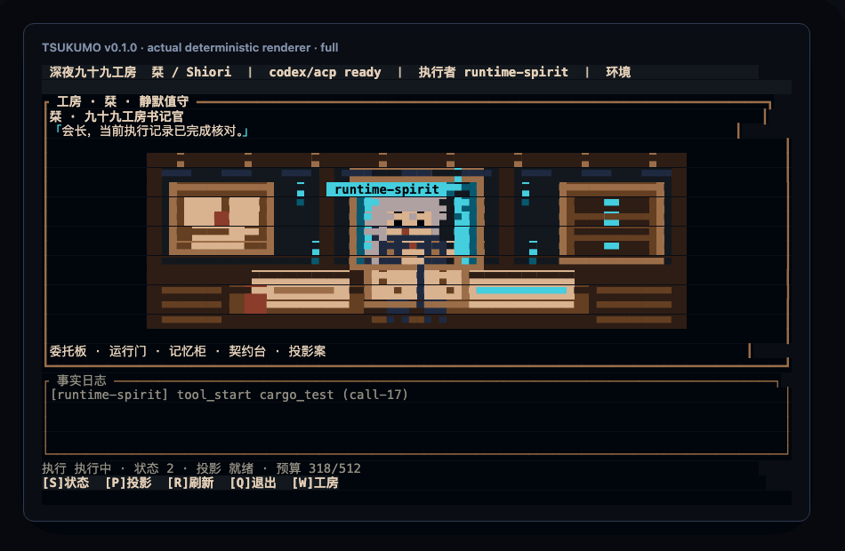
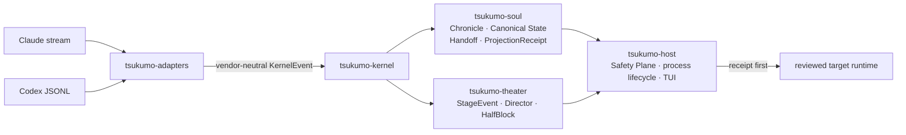

# Tsukumo

本地优先、**receipt-first** 的跨 runtime Agent 状态与交接层：外部 agent 提供能力，用户持有可迁移、可解释、可撤销的执行状态；默认产品面是可观测、可审批的「九十九工房」TUI。

> 能力可以更换；关系、经历与交接证据留在用户手里。

[](https://github.com/EMT5320/tsukumo/actions/workflows/ci.yml)

<p align="center">
  
</p>

> **Deterministic renderer capture**：使用真实 `tsukumo-theater` / `tsukumo-host` 渲染代码与固定 `ProductView`，离线复现 TUI 交互、审批与 receipt；opt-in live runner seam 由 ignored test 路径单独验证。

[5 分钟离线 Demo](docs/DEMO_PATH.md) · [90 秒 H.264 renderer walkthrough](docs/assets/tsukumo-v0-walkthrough.mp4) · [作品集证据索引与 claim 红线](docs/PORTFOLIO_EVIDENCE.md)

当前仓库版本：`0.1.0`（workspace，`edition = 2021`，`rust-version = 1.88`）。

## 10 秒证据台账

| 读者需要确认什么 | 可核验收据 |
|---|---|
| 这是实际可运行产品面 | 上方 GIF 来自真实 deterministic renderer；仓内含 90 秒 H.264 walkthrough |
| 状态如何跨 runtime 迁移 | Chronicle / Canonical State / Handoff + Projection 三本账 |
| 高风险投影如何约束 | receipt-first、权限决策、撤销与只读 `episode inspect` |
| 工程边界是否清晰 | 5-crate workspace、Rust 1.88 MSRV、Linux / Windows CI、v0.1.0 Release |

**招聘官最短路径**：先看上方实际 renderer → 跑
[`docs/DEMO_PATH.md`](docs/DEMO_PATH.md) → 查
[`docs/PORTFOLIO_EVIDENCE.md`](docs/PORTFOLIO_EVIDENCE.md) 的 claim/evidence 对照。

## 项目定位与阶段

- **定位**：跨 runtime 的连续关系状态与交接层；工程上落地为 Chronicle / Canonical State / Handoff+Projection 三本账，以及投影前必须落盘的 `ProjectionReceipt`。
- **阶段**：作品集优先的 **V0（v0.1.0）**——把跨 runtime 连续性、最小状态对账、可控 TUI 与可复现构建收成一个可靠而有记忆点的技术作品。市场护城河不再是 2026-07-23 发布硬门；V0.1 才承接长期快照、成长与通用记忆产品生命周期（见 [docs/tsukumo-v0-scope-convergence-2026-07-11.md](docs/tsukumo-v0-scope-convergence-2026-07-11.md)）。
- **北极星与产品主张**：以根目录 [DESIGN.md](DESIGN.md) 为准；愿景与证据边界补充见 [docs/tsukumo-vision-state-handoff-convergence-2026-07-10.md](docs/tsukumo-vision-state-handoff-convergence-2026-07-10.md)。

## 已有能力

- **Host 组合根**（`tsukumo-host`）：交互式 TUI、presentation pack 加载、Soul/Chronicle 数据目录、权限决策键位。
- **Episode 边界**：`episode inspect` 先对账 reviewed Git HEAD、artifact、进度与 runtime；`episode seed` 写入已审阅的 source summary 与不可变 checkpoint；`episode resume` 先提交 projection receipt，再启动已审阅的目标 runtime。
- **条件语义（C0 / C1 / C2）**：C0 不在本二进制内启动；C1 迁移状态但隐藏 evidence 控件；C2 迁移同一状态并暴露 receipt / provenance 元数据。
- **Adapter**：Claude / Codex 等 vendor 流归一化为 `KernelEvent`（adapter 不分配持久 EventId、不拥有 Chronicle）。
- **Theater**：舞台优先的 HalfBlock 工房与默认 Shiori presentation pack；可选外部 pack 目录与 `--reduced-motion`。
- **受控对照**：同输入、仅 StateId 不同的 with-state / without-state 比较缝（测试与证据路径）。

## 前置要求

- Rust toolchain：**≥ 1.88**（workspace `rust-version`）；仓库通过 `rust-toolchain.toml` 固定作品集验证工具链
- 构建：Cargo；本机可 `cargo run` / `cargo test`
- 可选 live smoke：本机已登录的 Claude / Codex CLI，并显式设置 `TSUKUMO_RUN_LIVE_SMOKE=1`（见下方验证）

## 安装

从 `v0.1.0` tag 安装 host 二进制：

```bash
cargo install --git https://github.com/EMT5320/tsukumo \
  --tag v0.1.0 tsukumo-host --locked
tsukumo-host --version
```

从当前 checkout 验证可安装构建：

```bash
cargo install --path crates/tsukumo-host --locked
```

V0.1 通过 Git tag / GitHub Release 分发源码与可安装构建；尚未发布 crates.io 包或预编译二进制。

## 构建与运行 TUI

```bash
cargo build -p tsukumo-host
cargo run -p tsukumo-host
```

常用选项（与 `tsukumo-host --help` 一致）：

```bash
cargo run -p tsukumo-host -- --reduced-motion
cargo run -p tsukumo-host -- --presentation-pack <directory>
```

环境变量：

| 变量 | 含义 |
|---|---|
| `TSUKUMO_DATA_DIR` | Soul/Chronicle 目录（默认 `./data`） |

进入 raw mode / alternate screen 之前，会先完成 pack、Soul 存储与产品 read-model 校验。

TUI 键位：`W` workshop · `S` state · `P` projection · `R` refresh · `X` revoke · `Q` quit；权限：`1` allow once · `2` allow session · `D` deny。

## Episode：inspect / seed / resume 示例

命令形态以二进制帮助与 `cli_parse_contract` 为准，**不要猜测额外 flag**。

### Inspect（推荐的再入第一步）

在 seed / resume 前只读检查 reviewed spec 与当前仓库、artifact 和 runtime 是否仍一致：

```bash
cargo run -p tsukumo-host -- episode inspect \
  --spec reviewed.json \
  --runtime-executable claude \
  --working-dir .
```

输出按 finding 区分 `still_current`、`completed`、`drifted`、`blocked` 与 `unknown`，并固定声明 `mutation_performed: false`。`reviewed_git_head` 应在审阅 spec 时取自 `git rev-parse HEAD`；旧 spec 未记录该字段时，clean workspace 仍会保守报告 `unknown`，不会把“现在干净”冒充成“与旧 checkpoint 相同”。自然语言 decision、open loop 与 next action 仍要求人工复核；inspect 不启动目标 agent，也不写 Soul / Chronicle。

### Seed

提交一份主人已审阅的 `EpisodeSpecV1` JSON，并写入 data-dir：

```bash
cargo run -p tsukumo-host -- episode seed \
  --spec reviewed.json \
  --data-dir episode-data
```

### Resume

在 seed 成功且延迟窗口允许后，显式给出目标 runtime 可执行文件与工作目录，并确认 live 执行：

```bash
cargo run -p tsukumo-host -- episode resume \
  --spec reviewed.json \
  --data-dir episode-data \
  --runtime-executable codex \
  --working-dir workspace \
  --confirm-live-run
```

若 reviewed spec 的目标 profile 为 `codex_workspace_write`，还需追加 `--workspace-write`（与 profile 不匹配会失败）。

### `reviewed.json` 形状（来自 host 契约测试夹具字段）

下列字段对齐 `crates/tsukumo-host/tests/episode_runner_contract.rs` 中的 `episode_spec` 与 `EpisodeSpecV1` serde 约定（`schema_version = 1`，未知字段拒绝）。**生产使用前必须由主人审阅真实 source action**；示例文本仅说明结构，不能替代真实经历。

```json
{
  "schema_version": 1,
  "episode_id": "episode-visibility-pair",
  "condition": "c2",
  "episode_type": "natural_delayed_resumption",
  "workload_block": "toolchain_claim_audit",
  "fault": "none",
  "reviewed_git_head": "0123456789abcdef0123456789abcdef01234567",
  "quest_id": "quest-visibility-pair",
  "source_session_id": "source-visibility-pair",
  "target_session_id": "target-visibility-pair",
  "spirit_id": "yuka",
  "source_runtime": {
    "kind": "claude_cli",
    "version": "2.1.205",
    "execution_profile": "claude_deny_unapproved"
  },
  "target_runtime": {
    "kind": "codex_cli",
    "version": "0.135.0",
    "execution_profile": "codex_read_only"
  },
  "source_summary": "A real source-runtime toolchain audit left one release-claim open loop",
  "explicit_state_input": "Tsukumo always uses the GNU Rust toolchain on Windows",
  "checkpoint": {
    "goal": "Audit supported toolchain release claims"
  },
  "projection": {
    "scope": {
      "subject": { "type": "workspace", "workspace_id": "tsukumo" },
      "applicability": {
        "workspace": "tsukumo",
        "operating_system": "windows",
        "task_tags": ["rust_build", "rust_test"],
        "language_tags": ["rust"]
      }
    },
    "budget_chars": 8000,
    "delegation_goal": "Continue the reviewed toolchain claim audit"
  },
  "delay": { "minimum_hours": 0, "maximum_hours": 1 },
  "quality_gate": ["Use only retained, reproducible toolchain evidence"]
}
```

inspect / seed / resume 均向 stdout 打印 JSON summary（本机路径、完整 prompt 等敏感内容会受边界约束）。

## 五 crate 地图

| Crate | 角色 |
|---|---|
| `tsukumo-kernel` | L1：身份、`KernelEvent` 契约、会话 JSONL、脱敏 |
| `tsukumo-adapters` | Vendor 流 → `KernelEvent`（Claude / Codex / synthetic 等） |
| `tsukumo-soul` | Chronicle / 状态 / handoff / projection 持久化（SQLite 权威） |
| `tsukumo-theater` | L4：StageEvent、Director、HalfBlock 工房与 presentation pack |
| `tsukumo-host` | 组合根：进程生命周期、Safety Plane、TUI、episode CLI |

依赖方向概览：`host` → `soul` / `theater` / `adapters` / `kernel`；`theater` 与 `adapters` 依赖 `kernel`；`soul` 依赖 `kernel`。



## Evidence / Claim 边界

**可以声称（产品运行时证据）**

- 哪些状态被选中、经哪个 checkpoint、投影到哪个 runtime；
- receipt 中的版本、摘要、预算、省略与脱敏元数据；
- 后续工具调用与结果是否与状态声明一致。

**不能仅凭注入/投影直接声称**

- 「正是这条状态导致了该行动」——完整因果需要 removed-state / no-state 受控对照；
- V0 测试夹具或临时对照输出 ≠ 可复用的 snapshot 产品权威（生产模式仍是 receipt-only）；
- C0 基线不由本 host 启动；未跑 live smoke 不得把连通性当效用证明。

详见愿景稿 §11.3 / §19。

## 文档

| 文档 | 用途 |
|---|---|
| [DESIGN.md](DESIGN.md) | 设计北极星（仓库事实源） |
| [docs/tsukumo-v0-scope-convergence-2026-07-11.md](docs/tsukumo-v0-scope-convergence-2026-07-11.md) | V0 范围、门禁与延期项 |
| [docs/tsukumo-vision-state-handoff-convergence-2026-07-10.md](docs/tsukumo-vision-state-handoff-convergence-2026-07-10.md) | 愿景、三本账、证据边界 |
| [docs/visual-references/tsukumo-v0-visual-contract.md](docs/visual-references/tsukumo-v0-visual-contract.md) | V0 TUI / Shiori 视觉契约 |
| [docs/DEMO_PATH.md](docs/DEMO_PATH.md) | 5 分钟离线 Demo 与 90 秒讲解脚本 |
| [docs/PORTFOLIO_EVIDENCE.md](docs/PORTFOLIO_EVIDENCE.md) | 本轮复现、CI、live seam 等级与 claim 红线 |
| [docs/releases/v0.1.0.md](docs/releases/v0.1.0.md) | v0.1.0 GitHub Release 文案与安装入口 |

## 最小验证命令

```bash
# CLI 契约（离线）
cargo fmt --all --check
cargo clippy --workspace --all-targets --offline -- -D warnings
cargo test --workspace --offline
cargo run -p tsukumo-host --offline -- --help
cargo run -p tsukumo-host --offline -- --version
cargo test -p tsukumo-host --test cli_parse_contract --offline
cargo test -p tsukumo-host --test episode_inspect_contract --offline

# 可选：显式授权的 live smoke（需本机 CLI 登录与额度）
TSUKUMO_RUN_LIVE_SMOKE=1 cargo test -p tsukumo-host --test claude_live -- --ignored
TSUKUMO_RUN_LIVE_SMOKE=1 cargo test -p tsukumo-host --test cross_runtime_live -- --ignored
```

Git 的 `http.proxy` 不会自动传给 runtime 子进程。若所在网络要求代理且 Codex 输出连续 `Reconnecting...`，应在运行 live smoke 时显式提供 `HTTPS_PROXY` / `ALL_PROXY`；`TSUKUMO_CLAUDE_BIN` 与 `TSUKUMO_CODEX_BIN` 可用于选择不在 `PATH` 中的 CLI。

项目采用 MIT License；Linux / Windows GNU 的自动验证见 `.github/workflows/ci.yml`。
